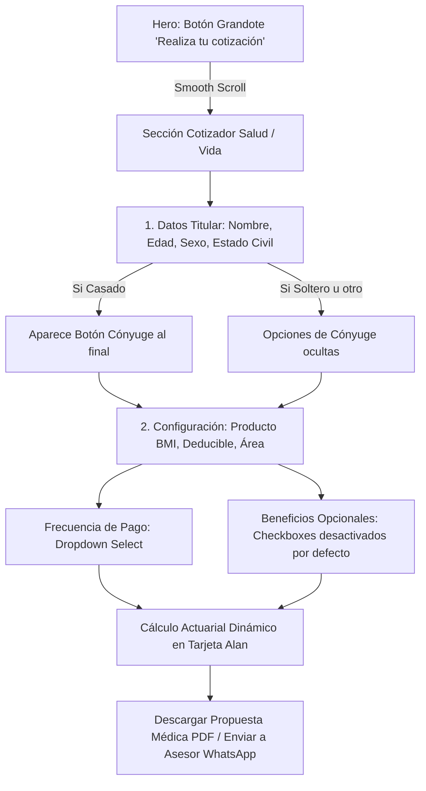

# 🏥 Cotizador de Salud & Vida Inspirado en Alan.com y Estándares Impeccable

Sincronizado con la bóveda de Obsidian: `[[BMI_PRODUCTOS_RAMOS_CALCULOS]]` y `[[01_Arquitectura_Ecosistema]]`.

---

## 🌟 1. Filosofía de Diseño Impecable & Referente Alan.com

El rediseño integral de **Vital Seguros** adopta la estética de **Alan Health** (París, referencia de insurtech mundial) combinada con los principios de diseño de **Emil Kowalski**:
- **Claridad Absoluta (Content-First):** Se eliminó el pesado *glassmorphism* que nublaba la fotografía de alta definición del Hero. En su lugar, se implementó una película direccional (oscura en el lado izquierdo para máximo contraste del texto, y completamente transparente hacia la derecha para que la imagen familiar luzca nítida y vibrante).
- **Hero Enfocado:** El cotizador fue retirado del Hero para dar paso a un mensaje editorial contundente y un **botón grandote de llamado a la acción ("Realiza tu cotización")**, permitiendo que el usuario explore el valor antes de interactuar con el formulario.
- **Formulario Salud Alan Style:** 
  1. Entradas táctiles de 44px de alto con bordes suaves de radio 12px (`rounded-xl`).
  2. Cero casillas premarcadas por defecto (Parto, Trasplantes y Ambulancia Aérea arrancan en `false`).
  3. Secuencia de datos: `Nombre`, `Edad`, `Sexo` (selector limpio), `Estado Civil` (no obligatorio).
  4. Si el estado civil es **Casado**, aparece de forma reactiva el **botón de inclusión de cónyuge al final** con un descuento del 10%.
  5. Campo de teléfono/contacto compacto sin desperdiciar espacio horizontal.
  6. **Frecuencia de pago en lista desplegable tipo catálogo de salud** (Anual, Semestral, Trimestral, Mensual).

---

## 🗺️ 2. Flujo Actuarial y Experiencia de Usuario (Mermaid)

---

## 📊 3. Especificaciones Técnicas

| Elemento | Implementación Técnica | Estado |
| :--- | :--- | :--- |
| **Hero Background** | Imagen WebP nítida de 2.7MB con overlay gradiente direccional `from-[#060709] to-transparent` y altura optimizada a viewport (`lg:h-[100dvh] lg:max-h-[850px]`) para anclar stats al borde inferior | ✅ Activo |
| **Hero CTA** | Botón `Realiza tu cotización` (`px-9 py-4`, gradiente dorado, hover glow y scale) | ✅ Activo |
| **Salud: Anexos** | Maternidad, Trasplantes, Evacuación Médica inician desmarcados (`false`) | ✅ Activo |
| **Salud: Estado Civil** | Selector opcional; despliega botón de cónyuge al final de la fila cuando es `Casado(a)` | ✅ Activo |
| **Salud: Teléfono** | Entrada compacta proporcional con alternancia entre celular y correo | ✅ Activo |
| **Salud: Frecuencia** | Menú desplegable nativo estilizado en lugar de botones apiñados | ✅ Activo |
| **Vida: Anexos** | Muerte accidental por defecto en `false` | ✅ Activo |
