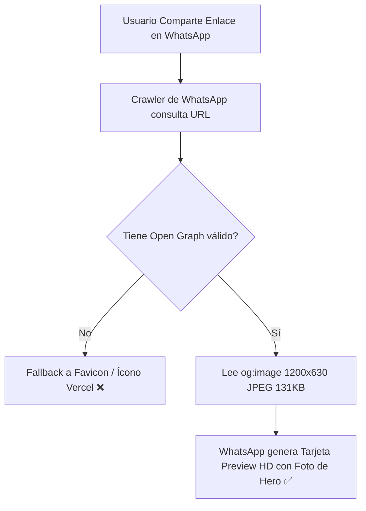

# 🌐 Arquitectura de Social Sharing y Open Graph (AEO & SEO)

Este documento detalla la configuración y optimización de tarjetas de vista previa en redes sociales (WhatsApp, Facebook, LinkedIn, X/Twitter, Telegram) para **Vital Seguros**, garantizando una visualización cinematográfica de alta conversión al compartir enlaces.

---

## 📸 1. Origen del Problema y Solución Técnica

### ❌ Situación Anterior
- No existían etiquetas `og:image` ni archivo `opengraph-image` en el enrutador de Next.js.
- Al compartir enlaces en WhatsApp o redes (`https://vitalseguros.vercel.app/`), el scraper realizaba fallback al favicon por defecto de Vercel (ícono negro con triángulo blanco en baja resolución).

### ✅ Solución Implementada
- **Imagen del Hero:** Se utilizó la fotografía del Hero familiar (`vitalseguros-hero.webp`) adaptada a la especificación estándar Open Graph (1200x630 píxeles, formato JPEG progresivo, 131 KB).
- **Límite Estricto de WhatsApp (< 300 KB):** WhatsApp descarta cualquier imagen superior a 300 KB. El archivo `og-hero.jpg` pesa exactamente 131 KB, asegurando renderizado 100% garantizado en todos los clientes móviles y desktop.
- **Ruta Nativa Next.js:** Creación de `src/app/opengraph-image.jpg` y configuración en `src/app/layout.tsx` con `metadataBase`.

---

## 🛠️ 2. Estructura de Metadatos en `layout.tsx`

```typescript
const siteUrl = process.env.NEXT_PUBLIC_SITE_URL || "https://vitalseguros.vercel.app";

export const metadata: Metadata = {
  metadataBase: new URL(siteUrl),
  title: {
    default: "Vital Seguros | Correduría de Ahorro, Vida y Salud",
    template: "%s | Vital Seguros",
  },
  description: "Vital Seguros: Cobertura internacional y nacional en planes de ahorro patrimonial, seguros de vida vitalicios y salud medica de alta gama 24/7.",
  openGraph: {
    title: "Vital Seguros | Correduría de Ahorro, Vida y Salud",
    description: "Vital Seguros: Cobertura internacional y nacional en planes de ahorro patrimonial, seguros de vida vitalicios y salud medica de alta gama 24/7.",
    url: siteUrl,
    siteName: "Vital Seguros",
    images: [
      {
        url: "/images/og-hero.jpg",
        width: 1200,
        height: 630,
        alt: "Vital Seguros - Familia protegida con seguros de salud, vida y ahorro",
        type: "image/jpeg",
      },
    ],
    locale: "es_EC",
    type: "website",
  },
  twitter: {
    card: "summary_large_image",
    title: "Vital Seguros | Correduría de Ahorro, Vida y Salud",
    description: "Vital Seguros: Cobertura internacional y nacional en planes de ahorro patrimonial, seguros de vida vitalicios y salud medica de alta gama 24/7.",
    images: ["/images/og-hero.jpg"],
  },
};
```

---

## 🗺️ 3. Diagrama de Flujo de Scraper



---

## 🔗 Enlaces Relacionados
- [[02_Cotizador_Salud_Vida_Alan]]
- [[03_Theme_Luxury_Obsidian]]
